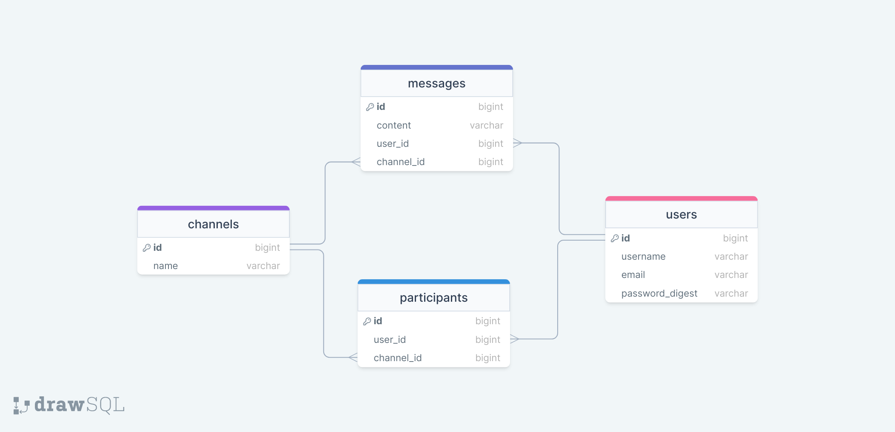

<a name="readme-top"></a>

<div align="center">
  
  <br/>

<h3><b>Chateo</b></h3>

</div>

<!-- TABLE OF CONTENTS -->

# 📗 Table of Contents

- [📖 About the Project](#about-project)
    - [🛠 Built With](#built-with)
        - [Tech Stack](#tech-stack)
        - [Key Features](#key-features)
    - [🚀 Live Demo](#live-demo)
- [💻 Getting Started](#getting-started)
    - [Setup](#setup)
    - [Prerequisites](#prerequisites)
    - [Install](#install)
    - [Usage](#usage)
    - [Run tests](#run-tests)
    - [Deployment](#deployment)
- [👥 Authors](#authors)
- [🔭 Future Features](#future-features)
- [🤝 Contributing](#contributing)
- [⭐️ Show your support](#support)
- [🙏 Acknowledgements](#acknowledgements)
- [📝 License](#license)

<!-- PROJECT DESCRIPTION -->

# 📖 Chateo <a name="about-project"></a>

**Chateo** is a chat app. Slack is one of the most widely used collaboration and messaging platform used by software teams worldwide, and boasts of a wide range of functionalities and sleek UI. You will implement features like user authentication, public channels, DM features, and private channels, and optionally, even notifications, user profile edits and more! 

## 🛠 Built With <a name="built-with"></a>

### Tech Stack <a name="tech-stack"></a>

<details>
  <summary>Client</summary>
  <ul>
    <li><a href="https://hotwired.dev/">Hotwired</a></li>
  </ul>
</details>

<details>
  <summary>Server</summary>
  <ul>
    <li><a href="https://rubyonrails.org/">Rails</a></li>
  </ul>
</details>

<details>
<summary>Database</summary>
  <ul>
    <li><a href="https://www.postgresql.org/">PostgreSQL</a></li>
  </ul>
</details>

<!-- Features -->

### Key Features <a name="key-features"></a>

- **Auth: Login/SignUp - Email confirmation**
- **Direct Messages**
- **Channels**
- **UI/UX**
- **Avatar profile**
- **Attachments**

<p align="right">(<a href="#readme-top">back to top</a>)</p>

<!-- LIVE DEMO -->

## 🚀 Live Demo <a name="live-demo"></a>

- [Live Demo Link](https://google.com)

<p align="right">(<a href="#readme-top">back to top</a>)</p>

<!-- GETTING STARTED -->

## 💻 Getting Started <a name="getting-started"></a>

To get a local copy up and running, follow these steps.

### Prerequisites

In order to run this project you need:

- Rails
- PostgreSQL
- RubyMine
- Git

### Setup

Clone this repository to your desired folder:

```sh
  cd my-folder
  git clone https://github.com/andrianarivo/chateo.git
```

### Install

Install this project with:

```sh
  cd my-project
  bundle install
  rails db:setup
```

### Usage

To run the project, execute the following command:

```sh
  rails server
```

### Run tests

To run tests, run the following command:

```sh
  rspec spec
```

### Deployment

You can deploy this project using your own deployment solution.

<p align="right">(<a href="#readme-top">back to top</a>)</p>

<!-- AUTHORS -->

## 👥 Authors <a name="authors"></a>

👤 **David**

- GitHub: [@andrianarivo](https://github.com/andrianarivo)
- Twitter: [@dandrianarivo](https://twitter.com/dandrianarivo)
- LinkedIn: [LinkedIn](https://linkedin.com/in/andrianarivo)

<p align="right">(<a href="#readme-top">back to top</a>)</p>

<!-- FUTURE FEATURES -->

## 🔭 Future Features <a name="future-features"></a>

- [ ] **Unread messages notifications**
- [ ] **Playing Sounds**
- [ ] **Markdown**
- [ ] **Slash Commands**
- [ ] **Record and send audio**
- [ ] **GIF Support**

<p align="right">(<a href="#readme-top">back to top</a>)</p>

<!-- CONTRIBUTING -->

## 🤝 Contributing <a name="contributing"></a>

Contributions, issues, and feature requests are welcome!

Feel free to check the [issues page](../../issues/).

<p align="right">(<a href="#readme-top">back to top</a>)</p>

<!-- SUPPORT -->

## ⭐️ Show your support <a name="support"></a>

If you like this project consider adding a ⭐️

<p align="right">(<a href="#readme-top">back to top</a>)</p>

<!-- ACKNOWLEDGEMENTS -->

## 🙏 Acknowledgments <a name="acknowledgements"></a>

I would like to thank Novity for the idea inspiration.

<p align="right">(<a href="#readme-top">back to top</a>)</p>

<!-- LICENSE -->

## 📝 License <a name="license"></a>

This project is [MIT](./LICENSE) licensed.

<p align="right">(<a href="#readme-top">back to top</a>)</p>
